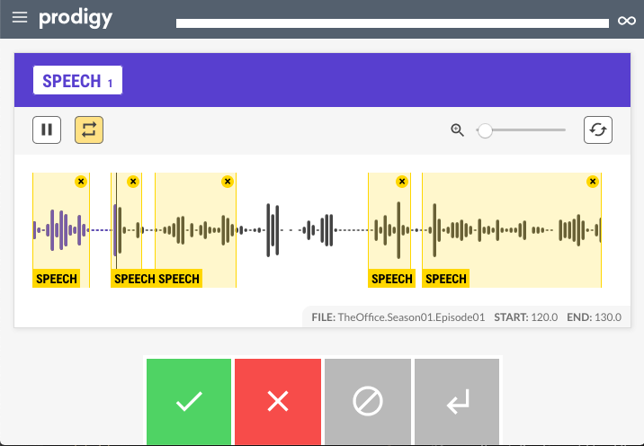
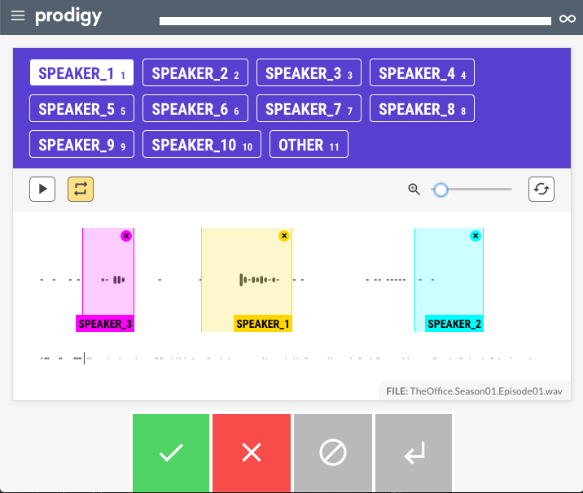
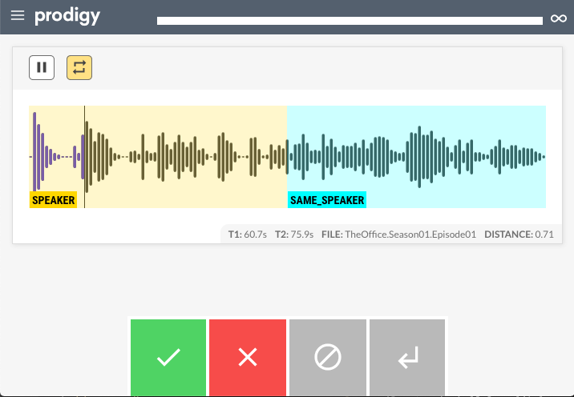

# Annotate your own data semi-automatically with Prodigy

Manually annotating data for training is time consuming.
Luckily, `pyannote.audio` comes with a bunch of [Prodigy](https://prodi.gy) recipes that should speed things up a bit.

## Speech activity detection with `pyannote.sad.manual`

The `pyannote.sad.manual` recipe will stream in `.wav` files in chunks and tag the detected speech regions as `SPEECH`.
You can then adjust the regions manually if needed.

## Speaker diarization with `pyannote.dia.manual`

The `pyannote.dia.manual` recipe will stream in `.wav` files and tag each speaker with its own `SPEAKER_X` tag.
You can then adjust and re-assign the regions manually if needed.

Note that, if you ran the `pyannote.sad.manual` recipe first, the manually adjusted speech regions boundaries will be used so that you can focus on the tagging part.

## Speaker comparison with `pyannote.dia.binary`

While the `pyannote.dia.manual` recipe might be useful is some cases, it might be impractical to use for longer files with lots of speakers.

The `pyannote.dia.binary` recipe will play two short excerpts of the manually adjusted speech regions from the `pyannote.sad.manual` recipe and ask you whether they were uttered by the same speaker.

Your answers will then be used to improve the initial suggestion of `pyannote.dia.manual` recipe.
In practice, they will serve as "cannot link" or "must link" constraints in the internal hierarchical agglomerative clustering part of the speaker diarization pipeline.

## Disclaimer

If you are using this feature, please consider supporting the development of `pyannote.audio` (either through [`Github Sponsors`](https://github.com/sponsors/hbredin)  or [via other ways](mailto:bredin@limsi.fr)) as I am not affiliated with [Explosion](https://explosion.ai) and will not get any money from your purchase of a [Prodigy](https//prodi.gy) license (nor be able to hire any academic researcher to further work on this).
